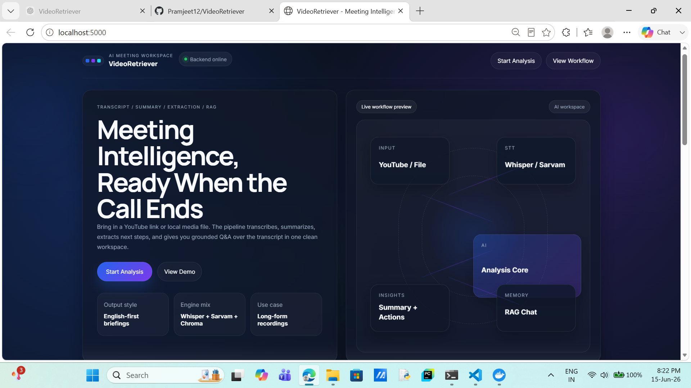
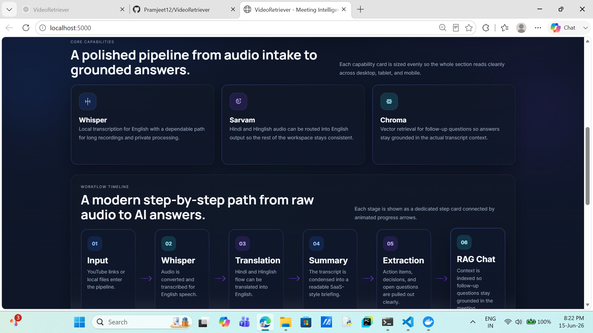
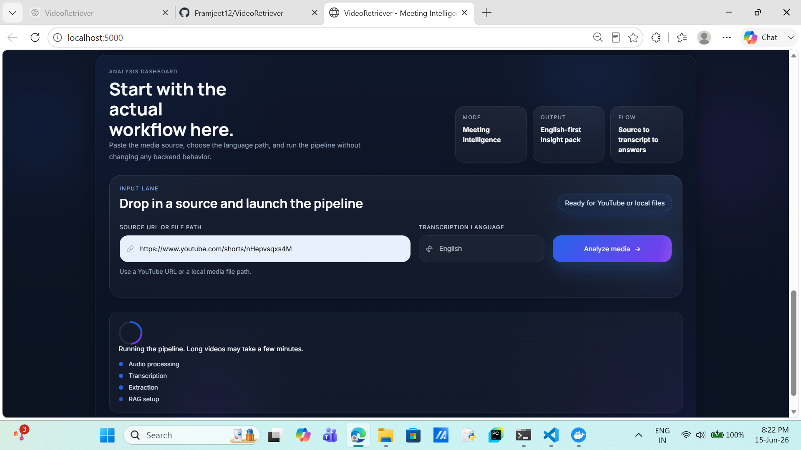
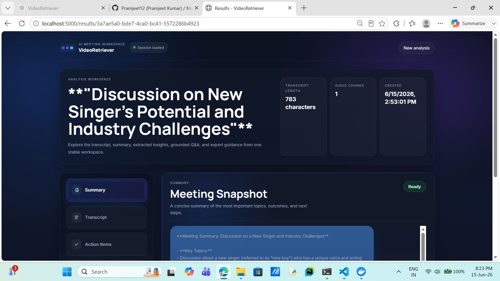
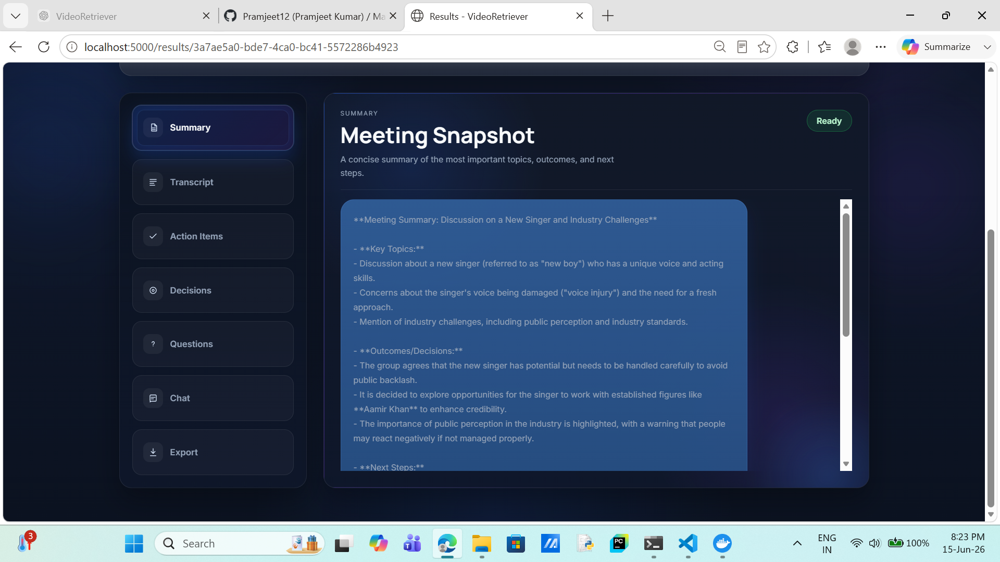
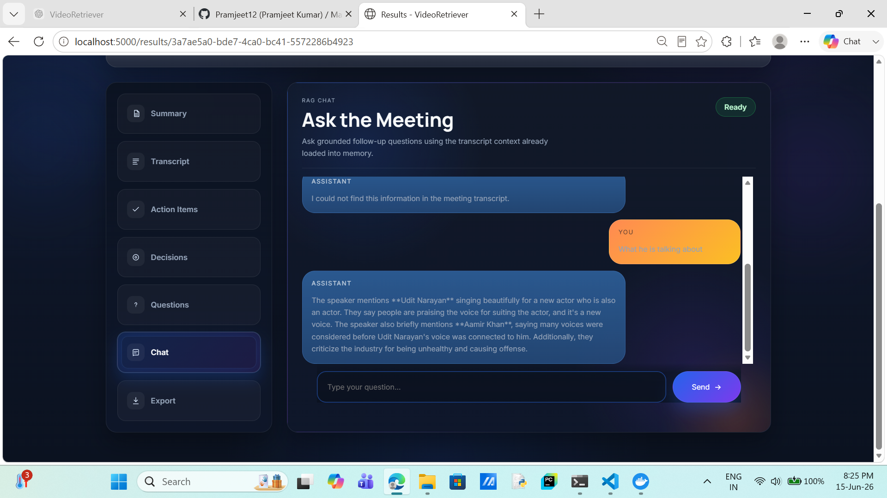

# VideoRetriever 

## Demo

### 1. Landing Page Hero

Shows the main landing section with the product introduction, primary call-to-action, and workflow preview.

### 2. Core Capabilities and Workflow Timeline

Highlights the main stack components and the step-by-step pipeline from raw audio to AI answers.

### 3. Analysis Dashboard and Input Lane

Displays the analysis form where users provide a source URL, choose the transcription language, and launch processing.

### 4. Results Workspace Overview

Shows the results page layout with session details, navigation tabs, and the main analysis workspace.

### 5. Meeting Summary View

Presents the generated summary panel inside the results workspace.

### 6. RAG Chat Experience

Demonstrates grounded follow-up questions over the transcript using the built-in chat panel.

