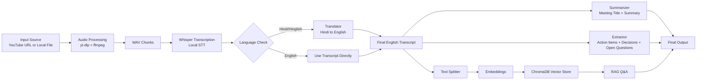

# VideoRetriever 

## 1. Project Overview

**VideoRetriever** is an AI meeting assistant built to help after a meeting ends. Give it a YouTube link or local audio/video file, and it can transcribe the conversation, create a summary, pull out action items, and let you ask questions later using RAG.

The idea is simple: provide a practical and budget-friendly post-meeting workflow by combining local processing with lightweight API-based components.

## 2. Problem Statement

Teams often lose important context after meetings:

- Notes are incomplete or missing
- Action items are not tracked clearly
- Decisions are hard to revisit later
- Searching long recordings is difficult
- Many existing tools are expensive

## 3. Proposed Solution

VideoRetriever automates the full post-meeting pipeline:

1. Accepts YouTube/Local media input
2. Converts media into processable wav chunks
3. Runs speech-to-text transcription
4. Optionally translates Hindi/Hinglish to English
5. Generates summary + title
6. Extracts action items, key decisions, and open questions
7. Stores embeddings in a vector database for RAG Q&A
8. Supports export of final outputs

## 4. Tech Stack and Tools

| Tool/Tech | Purpose |
|---|---|
| Python | Core application language |
| OpenAI Whisper (local) | Speech-to-text transcription |
| LangChain LCEL | Pipeline orchestration and reusable chains |
| Mistral AI (API) | Summarization, translation, information extraction |
| HuggingFace Embeddings (`all-MiniLM-L6-v2`) | Text embeddings for retrieval |
| ChromaDB | Local vector store for RAG |
| yt-dlp | Extract/download audio from YouTube |
| ffmpeg | Audio conversion and chunking |
| Streamlit | Optional UI/dashboard |
| fpdf2 | PDF export of results |

## 5. Core Pipeline Flow

## 6. Module-Level Design (As Shown in Architecture)

### `utils/audio_processor.py`
- Detects source type (YouTube URL or local file)
- Uses `yt-dlp` to fetch audio (YouTube path)
- Uses `ffmpeg` to normalize and split into WAV chunks
- Returns chunk file paths

### `core/transcriber.py`
- Loads Whisper model locally
- Transcribes each audio chunk
- Combines chunk transcripts into a single transcript
- Supports language-specific transcription mode

### `core/translator.py`
- Translates Hindi/Hinglish transcript to clean English
- Preserves technical terms and important entities
- Prepares transcript for downstream summarization/extraction

### `core/summarizer.py`
- Splits long transcript into chunks
- Performs map-reduce style summarization
- Generates concise meeting title and bullet summary

### `core/extractor.py`
- Uses reusable LCEL chains
- Extracts:
  - Action items (owner + deadline where available)
  - Key decisions
  - Open questions/follow-ups

### `main.py`
- Orchestrates end-to-end flow
- Calls each module in order
- Produces final structured output dictionary
- Can trigger interactive RAG Q&A phase

## 7. Inputs and Outputs

### Inputs
- YouTube URL or local media path
- Supported formats: MP4, MP3, WAV, M4A
- Language mode: English/Hindi/Hinglish

### Outputs
- Full transcript
- Translated English transcript (if needed)
- Meeting title
- Meeting summary
- Action items
- Key decisions
- Open questions
- RAG chat capability over transcript context
- Optional export file (for sharing/reporting)

## 8. Key Strengths

- Modular architecture (easy to maintain)
- Mix of local processing + low-cost API usage
- Supports multilingual meeting contexts
- Retrieval-ready data pipeline for semantic Q&A
- Practical workflow for teams and students

## 9. Future Enhancements

- Speaker diarization (who said what)
- Timestamped action items
- Multi-document/team knowledge base
- Role-based web app authentication
- Automated calendar/task integration

## 10. Conclusion

VideoRetriever is a complete AI meeting intelligence pipeline that converts raw audio/video into structured knowledge and searchable insights. It combines transcription, translation, summarization, extraction, and RAG in a single project flow designed for practical real-world use.
